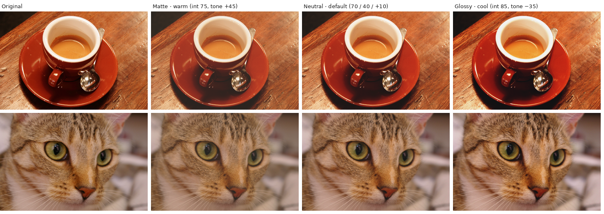

# Paper Print — Lightroom Classic plugin

Emulates the look of a darkroom print on photographic paper.

## Install

1. Clone or download this repository. The plugin is the `PaperPrint.lrplugin` folder inside it.
2. Lightroom Classic → **File › Plug-in Manager… › Add**, then pick that folder. If an older version is installed, remove it first.
3. Select one or more photos and choose **File › Plug-in Extras › Paper Print…**
   (also under **Library › Plug-in Extras** in the Library module).

## Controls

| Control | What it does |
|---|---|
| **Look** | Starting points: Neutral print, Warm fiber matte, Soft matte, Cream luster, Deep glossy, Cool glossy. Moving a slider switches it to *Custom*. |
| **Paper**: Matte / Neutral / Glossy | Sets the paper's maximum black (Dmax), contrast and surface. Matte has lifted, separated blacks, soft micro-contrast and a slight veil. Glossy has deep blacks, crisp contrast and richer colour. Neutral (pearl/luster) sits in between. |
| **Paper intensity** (0–100, default 70) | How strongly the paper character shapes contrast and depth. 0 = no paper response. |
| **Highlight roll-off** (0–100) | Bends the brightest tones smoothly into a slightly lowered paper white, so they compress instead of clipping. |
| **Paper tone** (−100 … +100) | Cool to warm. Tints the paper white (strongest in highlights) and the image tone: blue-black shadows on cool paper, brown-black on warm. |

**Live preview** updates the active photo as you move sliders. **Show original** flips the active photo back to its pre-paper look for comparison. **Apply** writes the effect to every selected photo, as a single undo step. **Cancel** restores the active photo exactly.

**Remove Paper Print** (same menu) puts photos back on the settings they had before the effect.

## How it works

Lightroom plugins can't process pixels, so the paper is expressed as develop settings:

- **Point curve** (`ToneCurvePV2012`) comes from a paper characteristic (D–logE) model:
  - Mid-tones follow the paper's gamma.
  - Shadows are scaled so the deepest detail just reaches the paper's Dmax, the way a printer chooses a paper grade.
  - Mid-grey is pinned (18 % in = 18 % out), then the highlight shoulder is applied.
- **Red / Green / Blue curves** add the paper base colour and image tone.
- **Saturation, Clarity, Texture and Dehaze** get small offsets for the paper surface, scaled by intensity.

### Curve accuracy

Lightroom draws a smooth spline through curve points, not straight lines. The plugin uses that same spline (the one in Adobe's open-source DNG SDK) to:

- place up to 16 points per curve, so the curve Lightroom draws stays within half a level (out of 255) of the paper model;
- read your existing curves exactly as Lightroom draws them.

### Your own edits are preserved

- The paper is layered **on top of** your existing point and channel curves.
- Your Saturation, Clarity, Texture and Dehaze get **offsets** added; they are not overwritten.
- Each photo remembers its paper settings and its pre-paper values in a hidden metadata field. Re-opening the dialog edits the existing paper instead of stacking a second one.
- If you change one of those settings in Develop after applying, your change becomes the new base.

### Presets

**Save as Preset** creates a Develop preset in the *Paper Print* folder of the Presets panel. Use it for batch work or Sync.

- Presets contain only the curves, built on a linear base, so they never touch your sliders. This means a preset carries no surface offsets (Clarity, Texture, Dehaze, Saturation).
- Applying a preset replaces any custom curve already on the photo. Use the dialog when you want to keep an existing curve.

## Notes and limits

- Requires Process Version 2012 or later. The dialog warns if a selected photo uses an older one.
- Texture needs Lightroom Classic 8.3 or newer; Dehaze needs Lightroom CC 2015 or newer. Older versions ignore them.
- Live preview writes to the catalog, so slider moves add steps to the History panel. Applying collapses the final result into one "Paper Print" step.

## Files

All plugin files live in `PaperPrint.lrplugin/`:

- `PaperModel.lua`: the paper model, Lightroom spline and curve fitting. Pure Lua with no Lightroom dependencies; tune the paper constants and looks at the top.
- `ShowDialog.lua`: the dialog and live preview.
- `RemoveEffect.lua`: the remove action.
- `State.lua`: per-photo state (base and applied values).
- `PaperMetadata.lua`: the hidden metadata field.
- `Info.lua`: plugin manifest.
